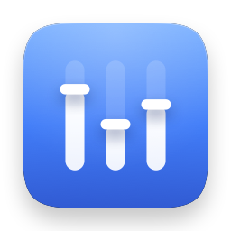

# Audio Manager



**A volume slider for every app, in your menu bar.**

macOS gives you one volume knob for the whole machine. Audio Manager gives you one per
app: mute Slack while a video keeps playing, turn a loud browser tab down without
touching your music, boost a quiet video call, or let only one app make sound while you
work.

It lives in the menu bar, has no Dock icon, and does nothing at all until you ask it to.

**Requires macOS 15 (Sequoia) or later.** Works on both Apple Silicon and Intel Macs.
Available in English and Turkish.

---

## What you can do with it

| | |
|---|---|
| **Mute one app** | Silence Slack, Discord or a browser without silencing anything else. |
| **Set a volume per app** | Music at 100%, the browser at 30%, all at the same time. |
| **Make something louder** | Boost up to +12 dB when a video or call is too quiet to hear. |
| **Shape the sound** | A 10-band equalizer per app — more bass for music, more clarity for speech. |
| **Focus mode** | Only the apps you allow can make sound. Everything else goes quiet. |
| **Profiles** | Save a whole setup as "Work" or "Music" and switch between them in one click. |
| **Schedules** | Mute Slack automatically on weekdays from 09:00, or switch profiles every evening. |
| **Hearing safety** | A volume ceiling that applies after every boost, so nothing can surprise you. |

---

## Installing

There are two ways. Homebrew is the one to pick if you plan to keep the app updated;
the manual download is fine if you would rather not touch a terminal.

### With Homebrew (recommended)

[Homebrew](https://brew.sh) is a package manager for the Mac — one command installs an
app, another updates it, another removes it cleanly. If you already use it, skip to the
two commands below.

**1. Open Terminal.** Press <kbd>⌘</kbd><kbd>Space</kbd>, type `Terminal`, press Return.

**2. Install Homebrew, if you do not have it yet.** Paste this in and press Return, then
follow what it prints — it will ask for your password and may take a few minutes:

```sh
/bin/bash -c "$(curl -fsSL https://raw.githubusercontent.com/Homebrew/install/HEAD/install.sh)"
```

If you are not sure whether you already have it, run `brew --version` first. If that
prints a version number, you are set.

**3. Tell Homebrew where Audio Manager lives.** The app is not in Homebrew's main
catalogue, so you point Homebrew at this repository once. That is what a "tap" is:

```sh
brew tap fatihbarackilic/audio-manager https://github.com/FatihBARACKILIC/audio-manager
```

**4. Install it:**

```sh
brew install --cask audio-manager
```

Homebrew downloads the app, checks Apple's signature on it, and puts
**AudioManager.app** in your Applications folder.

**To update later**, run:

```sh
brew upgrade --cask audio-manager
```

You can also update everything you installed with Homebrew at once with `brew upgrade`.

### By downloading it from GitHub

No terminal needed. Four steps:

**1. Open the release page.** It is here:
[latest release](https://github.com/FatihBARACKILIC/audio-manager/releases/latest).

**2. Download the app.** Under *Assets*, click `AudioManager-1.0.0.zip` — the number is
whatever the current version is. Safari unzips downloads for you; in other browsers,
double-click the file in your Downloads folder afterwards.

**3. Drag `AudioManager.app` into your Applications folder.** Open a Finder window,
press <kbd>⌘</kbd><kbd>⇧</kbd><kbd>A</kbd> to get to Applications, and drop it in.

**4. Double-click it to open.** The app is signed and notarised by Apple, so it opens
normally — no right-click-to-open workaround and no security warning to dismiss. If macOS
does complain, the download was incomplete; delete it and fetch it again.

**To update later**, come back to the same page, download the new version, and drag it
into Applications over the old one, choosing **Replace**. Quit Audio Manager from the
panel first. Your profiles, schedule rules and preferences are stored separately from the
app, so replacing it keeps all of them.

This is the route Homebrew saves you from repeating — if updating by hand sounds
tedious, it is worth the one-time setup above.

### The first launch

Open Audio Manager once from Applications. A speaker icon appears in the menu bar at the
top right of your screen — **that is the whole app**. There is no Dock icon and no window
until you open one.

If you want it to come back every time you log in, turn on **Open at login** in Settings.

---

## The permission it asks for

The first time you mute or adjust an app, macOS asks for permission to **record system
audio**. That prompt looks alarming, so here is exactly why it appears.

macOS has no API that simply says "set that app's volume to 40%". The only supported way
to control another app's audio is to *capture* its output, change it, and play the result
back. macOS classifies that as recording — so that is the permission it asks for. There
is no narrower one to ask for.

What Audio Manager actually does with it:

- Audio is processed in memory and thrown away, buffer by buffer.
- **Nothing is ever written to disk.** No recordings, no logs of what you played.
- **There is no network code in the app at all** — no analytics, no telemetry, no crash
  reporting, no update checks. It cannot send anything anywhere.
- Muting an app does not even read its audio: the stream is dropped untouched.

If you say no, the app keeps running and tells you how to grant the permission later
(System Settings → Privacy & Security → Microphone).

---

## Using it

Click the menu bar icon, or press <kbd>⌘</kbd><kbd>⇧</kbd><kbd>V</kbd>, and the panel
opens with every running app. Apps that are making sound right now are listed first.

### One row per app

Each row has a volume slider and a mute button. Click the chevron on the right for that
app's advanced controls.

The slider takes effect as you drag it, and the dots under it mark every 20%: click one
to jump straight to it, or drag past and the slider settles onto it when you get close.
Any value in between is still yours to pick, and the dot you are sitting on is filled in.

### Two modes per app

In the advanced controls you choose how much of an app Audio Manager takes over:

- **Mute only** *(the default)* — the app can be silenced, and nothing else. Its audio is
  never processed, so there is no delay of any kind.
- **Full control** — volume, boost and the equalizer all work, because the app's audio
  now travels through Audio Manager. This adds a few milliseconds of delay. That is
  invisible for music and video; for a live call you may prefer mute only.

Moving an app's volume slider switches it to full control for you, since a volume that
does nothing would be worse than a mode change.

### Focus mode

Focus mode silences everything except the apps you tick as allowed — useful when you want
one call, or one playlist, and nothing else. Give it a keyboard shortcut in Settings and
you can quiet the machine in one keystroke.

### Profiles

A profile captures your current setup under a name. Set your apps up the way you want
them, then **Settings → Profiles**, type a name, press **+**.

Switch between profiles from the menu at the bottom of the panel: "Work" mutes Slack and
Mail while your editor stays audible, "Music" brings it all back.

To change a profile later, activate it, adjust whatever you like in the panel, then press
**Update from current setup** in Settings → Profiles. There is no separate editor for
every setting, because the panel already is one.

### Schedules

A schedule rule applies inside a time window, on the weekdays you choose. It can mute a
set of apps, turn on focus mode, or activate a profile — "mute Slack on weekdays from
09:00 to 12:30", for instance. Rules that cross midnight and days that change length
work correctly.

Settings, reached from the gear in the panel, also covers launching at login,
notifications, the volume ceiling, and both keyboard shortcuts.

---

## If something is not working

**A muted app is still making sound.** Check the permission first — open the panel and
look for a banner at the top. Without permission to capture audio, macOS lets the app
keep playing rather than telling us anything is wrong.

**One app cannot be controlled at all.** Some audio cannot legally be captured — DRM
protected content is the usual case. Audio Manager will say so for that app rather than
pretending to work.

**An app you expected is missing from the list.** The panel shows apps that appear in the
Dock, plus anything currently making sound. Background helpers only appear while they are
playing, and Chrome, Brave, VS Code and other Electron apps are shown as one row rather
than one per helper process.

**The menu bar icon is gone.** macOS hides menu bar items when the bar runs out of room,
usually on a laptop with lots of icons and a notch. Try quitting another menu bar app.

**You want to start over.** Run this once, and every setting goes back to its default:

```sh
/Applications/AudioManager.app/Contents/MacOS/AudioManager --reset-settings
```

---

## Keeping your settings

**Settings → General → Export** writes your profiles, schedule rules and preferences to a
`.json` file you choose — worth doing before reinstalling macOS or moving to a new Mac.
**Import** reads one back.

The file is plain, readable JSON carrying its own version, so an export made today still
imports into a later version of the app. Import replaces your current settings rather
than merging them, and asks before it does. A file that is not an Audio Manager export is
refused with a message instead of being applied.

---

## Uninstalling

**Settings → General → Remove Audio Manager.** It deletes your profiles, schedule rules
and preferences, unmutes every app, turns off Open at login, quits, and shows itself in
Finder so you can drag it to the Trash.

That last step is yours because macOS does not let a sandboxed app delete its own bundle.

**If you installed with Homebrew**, use Homebrew instead, so it does not leave a dangling
record of an app that is no longer there:

```sh
brew uninstall --zap --cask audio-manager
```

`--zap` is what also removes your saved settings. Leave it off if you plan to reinstall
and want your profiles back.

---

## Privacy

No audio is recorded, stored or transmitted. No file is ever written except your own
settings, in `~/Library/Application Support/com.barackilic.AudioManager/`. The app
contains no networking code, so it cannot phone home even by accident.

---

## What it costs to run

Audio Manager is meant to be invisible in Activity Monitor. Measured on Apple Silicon
with a Release build:

| What it is doing | CPU | Memory |
|---|---|---|
| Nothing — idle in the menu bar | 0.0% | 13 MB |
| 4 apps muted, panel closed | 0.17% | 15 MB |
| 3 apps in full control with EQ, panel open and metering | ~1.0% | 16 MB |

When you are not controlling any app, the app holds no audio resources whatsoever — no
device, no processing, no timers. It wakes up when you or the system does something, and
not otherwise.

---

## Built with Apple frameworks only

Swift 6, no third-party dependencies, no audio driver, no private APIs. It uses **Core
Audio process taps**, the supported API for capturing another process's output.

What changed in each version is in the [changelog](CHANGELOG.md).

If you want to build it, read the code, or contribute, see
**[docs/DEVELOPING.md](docs/DEVELOPING.md)**. The rules the code is held to are in
[AGENTS.md](AGENTS.md).

## License

[MIT](LICENSE).
